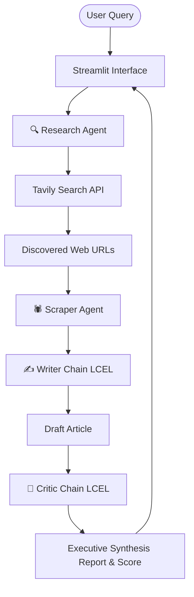

# 🧬 NexusResearch AI Agent

An autonomous multi-agent research pipeline built with **LangChain 1.3+**, **Google Gemini**, **Tavily Web Search**, and **Streamlit**. 

NexusResearch orchestrates a 4-stage pipeline that crawls live web content, extracts structured data, synthesizes technical executive reports, and critiques output quality in real time.

---

## 🌟 Key Features

* 🔍 **Autonomous Research Agent**: Uses LangChain's `create_agent` with Google Gemini (`gemini-3.6-flash`) to dynamically query web search APIs.
* 🕷️ **Web Content Scraper**: Cleanly extracts text content from discovered web endpoints using BeautifulSoup.
* ✍️ **LCEL Writer Chain**: Synthesizes search findings and scraped data into structured, publication-grade markdown reports.
* 🎯 **LCEL Critic Chain**: Evaluates draft articles for depth, clarity, structural accuracy, and provides constructive feedback with scoring out of 10.
* 💻 **Modern Streamlit Dashboard**: Sleek dark-mode interface with live status progress, interactive tabs, customizable parameters, and markdown export.

---

## 🏗️ Architecture Pipeline



---

## ⚙️ Prerequisites & Setup

### 1. Clone the Repository
```bash
git clone https://github.com/Muneeb-hub411/Research-Agent.git
cd Research-Agent
```

### 2. Create and Activate Virtual Environment
```bash
# Windows (PowerShell)
python -m venv .venv
.\.venv\Scripts\Activate.ps1

# Linux / macOS
python3 -m venv .venv
source .venv/bin/activate
```

### 3. Install Dependencies
```bash
pip install -r requirements.txt
```

### 4. Configure Environment Variables
Create a `.env` file in the root directory with your API keys:

```env
Gemini_Api_Key=your_google_gemini_api_key
Tavily_Api_Key=your_tavily_api_key
```

> **Note**: You can obtain API keys from [Google AI Studio](https://aistudio.google.com/) and [Tavily AI](https://tavily.com/).

---

## 🚀 Running the Application

Launch the Streamlit web application with:

```bash
streamlit run app.py
```

Open your browser at `http://localhost:8501`.

---

## 📁 Project Structure

```
Research-Agent/
├── app.py                     # Streamlit User Interface & Workflow Orchestration
├── requirements.txt           # Project Dependencies
├── .env                       # API Configuration (Git-ignored)
├── src/
│   ├── agents/
│   │   └── agent.py           # Research Agent Graph (LangChain create_agent)
│   ├── pipelines/
│   │   └── pipeline.py        # LCEL Writer & Critic Chains
│   └── tools/
│       └── tool.py            # Tavily Search Tool & BeautifulSoup Scraper
└── README.md                  # Project Documentation
```

---

## 🛠️ Technology Stack

* **Framework**: [LangChain](https://www.langchain.com/) & [LangGraph](https://www.langchain.com/langgraph)
* **LLM Engine**: [Google Gemini (`gemini-3.6-flash`)](https://ai.google.dev/)
* **Web Search API**: [Tavily Search](https://tavily.com/)
* **UI**: [Streamlit](https://streamlit.io/)
* **Web Parsing**: BeautifulSoup4 & Requests
